

# Hey, I'm Haluk 👋

*Turning on-chain noise into actionable signals — one pipeline at a time.*

---

## 🧭 About Me

I'm a **Mechatronics Engineer** turned **Data-Driven Developer** with a passion for building at the intersection of blockchain, automation, and analytics.

- 🏗️ Previously engineered mission-critical software at **Baykar Technologies** (the company behind Bayraktar TB2)
- ⛓️ Currently building **crypto analytics & automation tools** for DeFi traders and liquidity providers
- 🤖 Heavy user of AI-assisted development — Claude, vibecode, Bolt, Cursor (what some call *vibe coding*)
- 🏆 **3rd Place** — Superteam Solana Demo Day 2024
- 🦾 **TEKNOFEST Finalist** — Built an AI-powered robotic arm for Parkinson's patients
- 📊 Published polymarket-tweet analysis tool at [polyanalytics.xyz](https://polyanalytics.xyz)

---

## 🛠️ Tech Stack

### Data & Analytics

### Development

### Web3 / Blockchain

### Business & PM

---

## 🚀 Featured Projects

### 🔗 Multi-Chain Portfolio Analytics System
> End-of-day inflow/outflow reporting across Solana, Ethereum, Tron & Bitcoin

- Automated capital flow summaries with decision-support metrics
- Built with Python, AI tooling, and SQL-based data pipelines
- Tracks cross-chain behaviour and performance in real time

---

### 🤖 Solana Liquidity Pool Automation
> Telegram bot-integrated infrastructure for LP management

- Automated LP creation, monitoring, and auto-rebalancing on Solana
- REST API-based services with React UI

---

### 📈 polyanalytics.xyz — Prediction Market Research
> Published research: *Impact of Elon Musk tweets on prediction market outcomes*

- On-chain data extraction and behavioural analysis
- Liquidity cleanup dashboard for converted positions

---

---
 
### 🚗 Ycar — Mobile Car Wash Marketplace
> Two-sided marketplace connecting car owners with mobile washers in Turkey
 
- 📱 Expo + React Native + TypeScript frontend
- ⚙️ Bun + Hono backend, PostgreSQL + Prisma ORM
- 🔐 Passwordless auth (Email OTP via Better Auth + Resend)
- 🗺️ Real-time map, GPS location, Expo push notifications
- ☁️ Cloudflare R2 storage, Railway deploy
 
<table>
  <tr>
    <td align="center"><b>Giriş</b></td>
    <td align="center"><b>Doğrulama Kodu</b></td>
    <td align="center"><b>Keşfet (Müşteri)</b></td>
    <td align="center"><b>Yeni İlan</b></td>
  </tr>
  <tr>
    <td>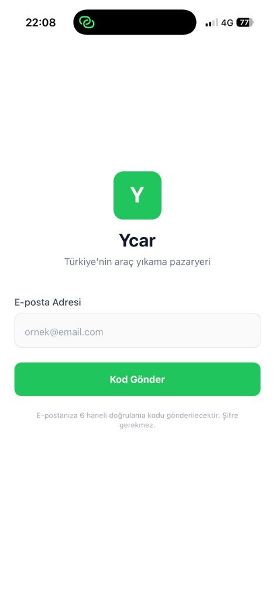</td>
    <td>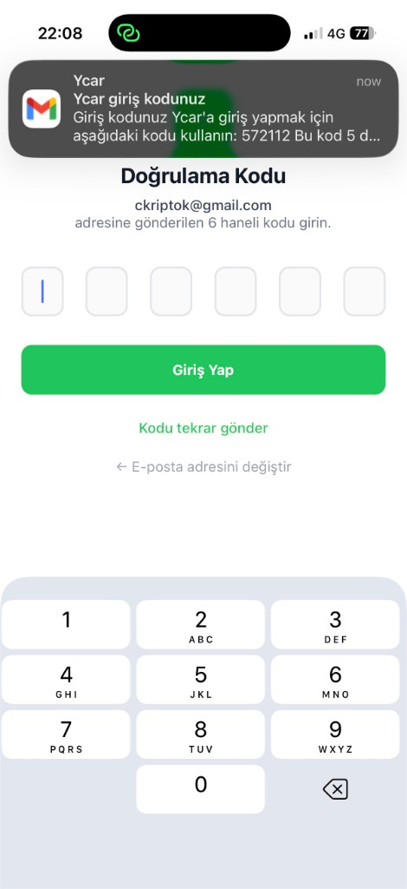</td>
    <td>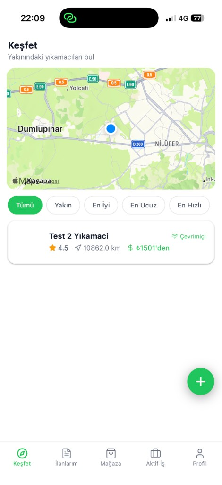</td>
    <td>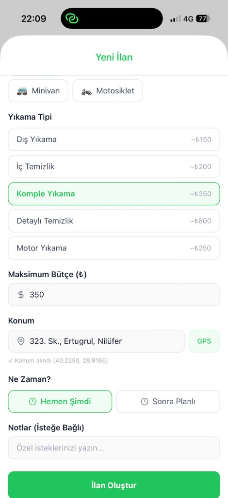</td>
  </tr>
  <tr>
    <td align="center"><b>İlan Oluşturuldu</b></td>
    <td align="center"><b>İlanlarım</b></td>
    <td align="center"><b>Mağaza</b></td>
    <td align="center"><b>Profil (Müşteri)</b></td>
  </tr>
  <tr>
    <td>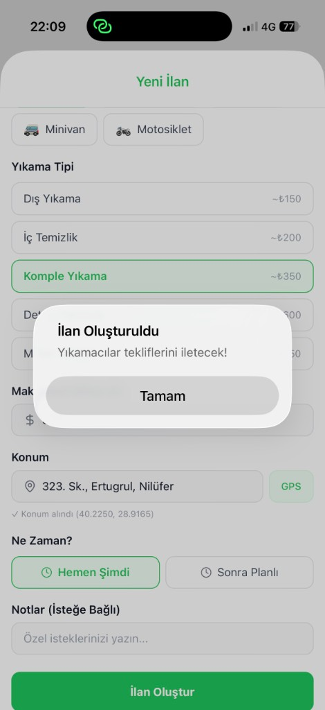</td>
    <td>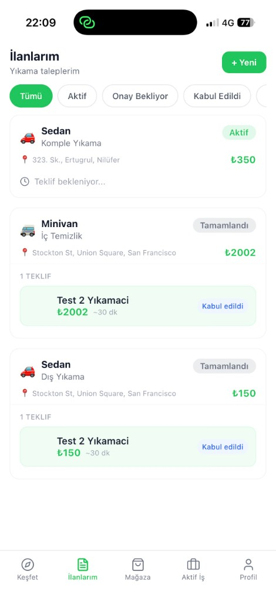</td>
    <td>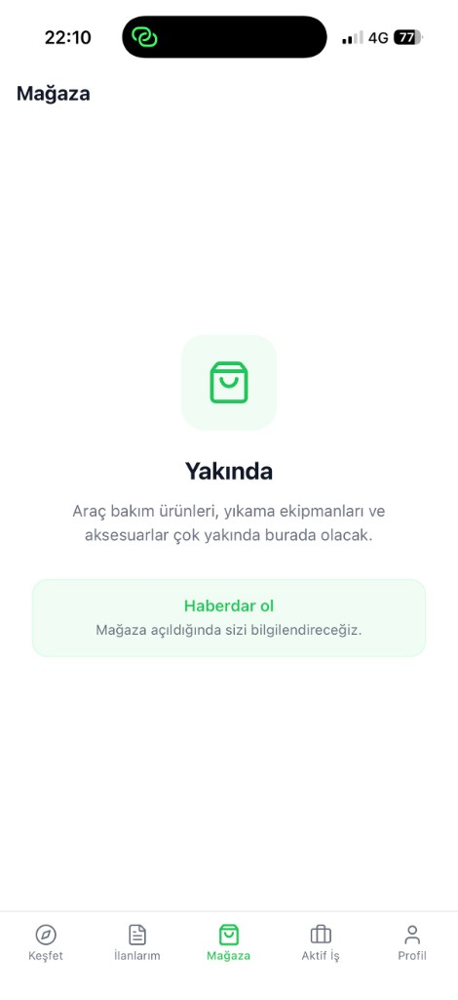</td>
    <td>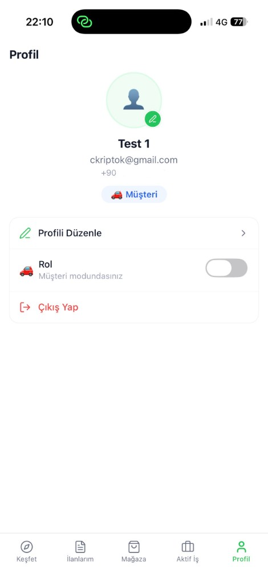</td>
  </tr>
  <tr>
    <td align="center"><b>Profil (Yıkamacı)</b></td>
    <td align="center"><b>Keşfet (Yıkamacı)</b></td>
    <td align="center"><b>İlan Detayı & Teklif</b></td>
    <td></td>
  </tr>
  <tr>
    <td>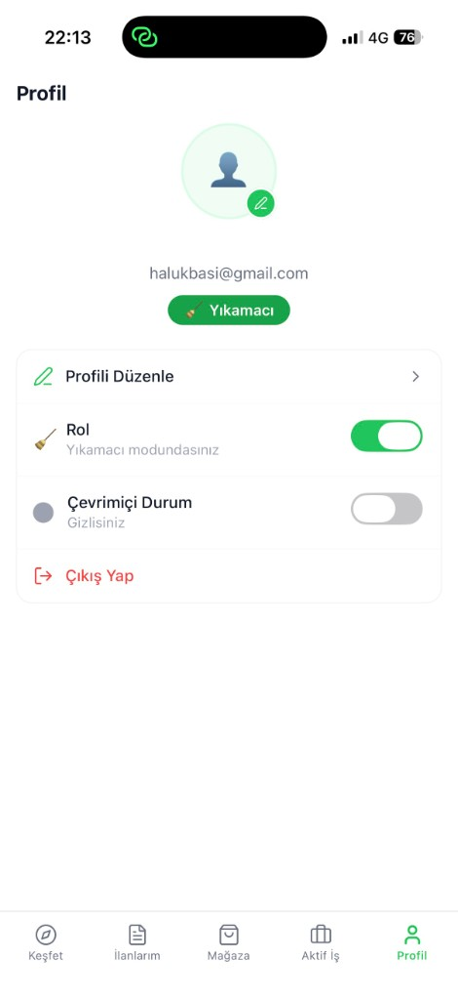</td>
    <td>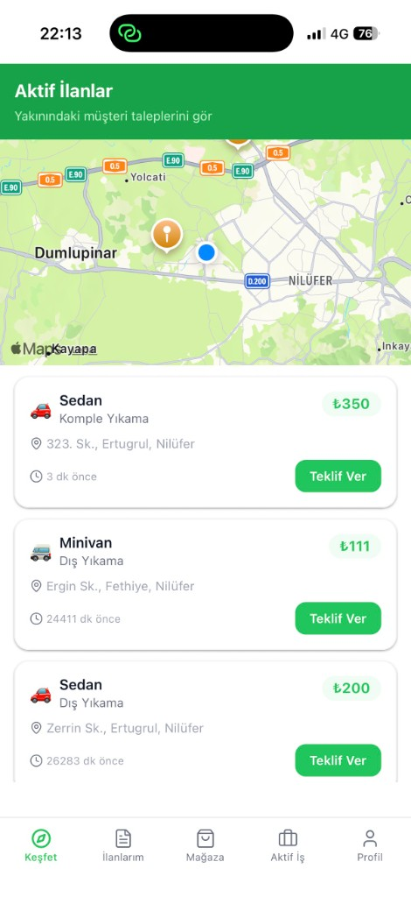</td>
    <td>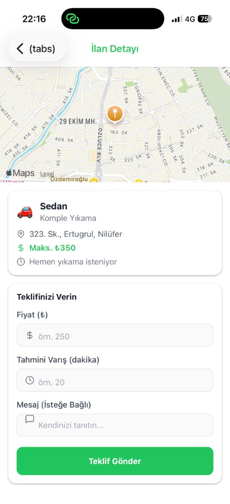</td>
    <td></td>
  </tr>
</table>
 
---

### 🦾 AI-Powered Robotic Arm (TEKNOFEST 2020 Finalist)
> 6-DOF robotic arm to assist individuals with Parkinson's disease or limb loss

- Real-time computer vision with Python & OpenCV
- Finalist at TEKNOFEST Technology for Humanity competition

---

## 📬 Let's Connect

I'm open to freelance projects, collaborations, and interesting problems in the **Web3, Fintech, and Data** space.

📧 [halukbasi@gmail.com](mailto:halukbasi@gmail.com)
💼 [linkedin.com/in/halukbasi](https://linkedin.com/in/halukbasi)
🔬 [polyanalytics.xyz](https://polyanalytics.xyz)

---

  Built with ☕ and on-chain curiosity

